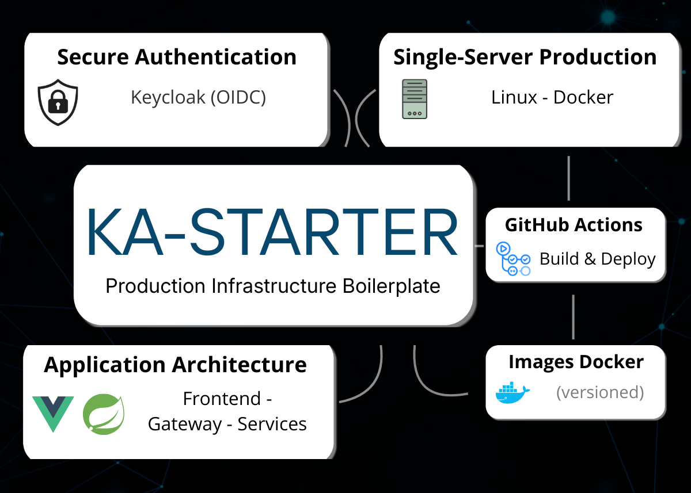
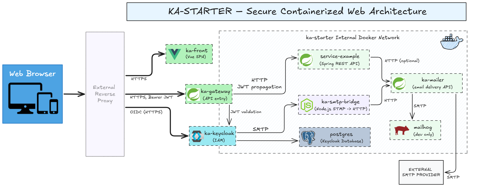

# ka-starter

> **Production Infrastructure Boilerplate** for Fullstack applications (Vue, Spring Boot, Keycloak).

## What is ka-starter?

**ka-starter** is a production-oriented infrastructure boilerplate
with a clear and consistent architectural approach
for modern web applications running on a single Linux server
(VPS, VM, or dedicated server).

It provides a reusable foundation for authentication, API security,
service separation, and Docker-based deployments,
so you can focus on building features instead of rebuilding infrastructure.

---

## How to use ka-starter

ka-starter can be used in four main ways:

1. Run locally for development
2. Deploy using the registry-based workflow (recommended)
3. Deploy using the SSH-based workflow (quick manual setup)
4. Use it as a copy-and-adapt boilerplate for a new project

### 1. Run locally

Local development is intended for feature development and debugging.
Services can be run individually or partially.

👉 See [Local development](dev/README.md) for details.

---

### 2. Deploy using the registry-based workflow (recommended)

The registry-based workflow is the recommended way to deploy ka-starter in production.

- Docker images are built in **GitHub Actions**
- Images are pushed to **GitHub Container Registry (ghcr.io)**
- The server only pulls and runs images using Docker Compose

This approach provides reproducible builds and easier rollbacks.

👉 See [REGISTRY_DEPLOY.md](deploy/docs/REGISTRY_DEPLOY.md) for detailed instructions.

---

### 3. Deploy using the SSH-based workflow (quick manual setup)

The SSH-based workflow is a more direct deployment method.

- Docker images are built directly on the server
- Services are started manually using Docker Compose over SSH

This mode is mainly intended for quick experiments or early MVPs.

👉 See [SERVER_DEPLOY.md](deploy/docs/SERVER_DEPLOY.md) for detailed instructions.

---

### 4. Use it as a copy-and-adapt boilerplate for a new project

ka-starter can be cloned and adapted as a boilerplate for new projects.

Typical usage includes:
- keeping the core infrastructure and architecture
- renaming services and images
- removing example services
- adding project-specific business logic 

👉 See [BOILERPLATE.md](BOILERPLATE.md)

---

#### Note on Reverse Proxy
This starter is designed for a **Single-Server Production** setup.
To handle SSL and routing, I recommend using [ka-proxy](https://github.com/franzk/ka-proxy), a dedicated Nginx reverse proxy built to work with this ecosystem.
You can also use any other reverse proxy of your choice (e.g. Traefik, Caddy, etc.) as long as it can route traffic to the API gateway, frontend and auth (keycloak) url.

---

## How it works

ka-starter is built around a simple, Docker-first architecture
designed to run on a single Linux server.

At a high level:
- the frontend is a single-page application (SPA)
- all API traffic goes through a single API gateway
- backend services are isolated and never exposed publicly
- authentication and authorization are handled by Keycloak (OIDC)
- HTTPS termination is handled outside the stack by a reverse proxy (not included)

### Architecture overview

### Services overview

The following services make up the ka-starter stack:

| Service         | Technology   | Description                            |
|-----------------|--------------|----------------------------------------|
| Frontend        | Vue 3 + Vite | SPA frontend                           |
| Gateway         | Spring Boot  | API Gateway (single entry point)       |
| Service Example | Spring Boot  | Example REST API (business logic)      |
| Keycloak        | Keycloak     | Identity & access management (IAM)     |
| PostgreSQL      | PostgreSQL   | Keycloak database                      |
| SMTP Bridge     | Node.js      | SMTP → HTTP bridge for Keycloak emails |
| Mailer          | Spring Boot  | Email delivery service (HTTP API)      |
| MailHog (dev)   | MailHog      | Development mailbox UI                 | 

⚠️ Note:   
Port exposure differs between local and dev environments.    
This will be normalized in a future iteration.

---
## Scope
ka-starter is not a project template or a turnkey SaaS.

It focuses on:
- OAuth2 / OIDC authentication with Keycloak
- Token-based API security
- Clean service separation
- Production-ready Docker setup

It is intended as a solid technical foundation,
not as a finished product.

---
## Contributing
1. Fork the repository
2. Create a feature branch
3. Commit clean, atomic changes
4. Open a Pull Request

---
## License

This project is licensed under the [MIT License](LICENSE).

---
## Support

[Open an issue](https://github.com/franzk/ka-starter/issues)
