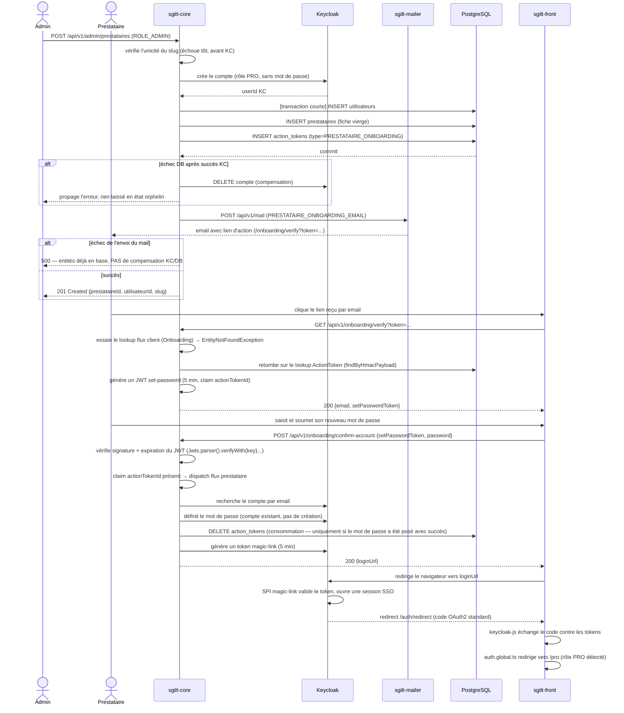

# Onboarding prestataire — flow technique

> Documentation technique du parcours complet de provisionnement d'un prestataire, du
> déclenchement par un admin jusqu'à la première connexion du prestataire. Pour le mode
> opératoire pratique ("comment créer un prestataire"), voir `PRO_ONBOARDING.md`.

## Vue d'ensemble

Le flow est découpé en 3 phases, toutes implémentées dans `sgilt-core` :

| Phase                    | Déclencheur                                  | Composants principaux |
|---------------------------|----------------------------------------------|------------------------|
| 1. Provisionnement admin | `POST /api/v1/admin/prestataires` (ROLE_ADMIN) | `AdminController`, `KeycloakAdminService`, `PrestataireService`, `UtilisateurService`, `ActionLinkService` |
| 2. Envoi du mail          | Fin de la phase 1, après commit DB            | `AdminMailerService`, `sgilt-mailer` |
| 3. Vérification + set-password | Clic du prestataire sur le lien reçu    | `VerifyService`, `OnboardingService`, `ActionTokenService`, `KeycloakAdminService` |

Le brief d'origine découpait ce travail en 4 étapes (provisionnement / set-password / mail /
verify). En pratique, l'étape "set-password" a été **absorbée** dans la phase 3 : il n'existe pas
d'endpoint dédié à la définition du mot de passe — c'est le même `POST /onboarding/confirm-account`
que celui déjà utilisé par le flux client, qui dispatch en interne selon le type de token.

---

## Séquence complète



---

## Phase 1 — Provisionnement admin

**Endpoint** : `POST /api/v1/admin/prestataires`, gardé par `ROLE_ADMIN` (distinct de `ROLE_PRO`,
porté uniquement par les comptes admin dédiés).

**Ordre des opérations**, du plus fragile au plus sûr :

1. Vérification de l'unicité du `slug` en base — échoue avant même d'appeler Keycloak si le slug
   est déjà pris.
2. Appel Keycloak (`KeycloakAdminService.createProUserWithoutPassword`) — **hors transaction DB**,
   pour ne pas tenir de connexion DB ouverte pendant l'aller-retour réseau. Crée le compte avec le
   rôle `PRO`, `emailVerified=true`, et **aucun credential** (donc aucun mot de passe utilisable).
3. Transaction DB courte (via `TransactionTemplate`, pas `@Transactional` — la frontière
   transactionnelle doit démarrer précisément après l'appel Keycloak, dans la même méthode) :
   - `Utilisateur` (email, prénom, nom)
   - `Prestataire` (fiche vierge : `slug`, `name`, `categoryKey`, `subcatKeys` seulement — tout le
     reste vide, le front gère l'état "ghost")
   - `ActionToken` (`type=PRESTATAIRE_ONBOARDING`, `payload={"email": ...}`)
4. Si la transaction DB échoue après que le compte KC a été créé : **compensation** — suppression
   du compte KC (`deleteUser`). Aucun prestataire ne doit rester à moitié provisionné.
5. Envoi du mail d'activation (phase 2), une fois la transaction commitée.

### Le mécanisme `ActionToken`

Généralisation du concept de token de confirmation, pensée pour être réutilisable par de futurs
flows (pas seulement l'onboarding prestataire) :

- `ActionType` porte un discriminant (`PRESTATAIRE_ONBOARDING`), un `frontPath` (route front à
  atteindre) et une `action` (ce que le front doit y déclencher).
- `ActionToken.payload` est un jsonb **libre**, propre à chaque flow — le mécanisme générique ne
  sait pas ce qu'il contient (ex. ici, juste `{"email": ...}`).
- `ActionLinkService.createLink(type, payload)` crée le token et construit l'URL d'action. **L'URL
  ne contient que le token opaque signé HMAC** — jamais `action` ni le `payload` en clair, parce
  que rien après le token dans l'URL n'est couvert par la signature (donc falsifiable si exposé).
  `type`/`action`/`payload` ne sont dérivables qu'en rechargeant la ligne `ActionToken` côté back,
  à la vérification.

### Compte-rendu des échecs

| Cas                                     | Réponse | KC          | DB                          |
|-------------------------------------------|---------|-------------|-------------------------------|
| Champ requis manquant                      | 400     | non appelé  | rien écrit                    |
| Slug déjà utilisé                          | 400     | non appelé  | rien écrit                    |
| Email déjà présent dans Keycloak           | 400     | échoue      | rien écrit (KC tenté en premier) |
| Échec DB après création du compte KC       | 500     | compensé (deleteUser) | rien ne reste          |
| Échec de l'envoi du mail                   | 500     | reste       | reste (aucune compensation)   |

Le dernier cas est **volontairement non compensé** : une fois la transaction DB commitée, tout
recréer coûterait un nouveau conflit de slug/email pour un nouvel appel. C'est un manque connu —
voir "Limitations connues" ci-dessous.

---

## Phase 2 — Envoi du mail

`AdminMailerService.sendPrestataireOnboardingEmail(prestataireEmail, firstName, actionUrl)` —
appelé après le commit de la transaction (jamais avant, pour ne jamais notifier un prestataire
dont les entités n'existent pas encore).

- Nouveau `MailType.PRESTATAIRE_ONBOARDING_EMAIL`, dupliqué et synchronisé à la main entre
  `sgilt-core` et `sgilt-mailer` (convention existante du projet — chaque `MailType` doit avoir un
  gabarit correspondant dans `sgilt-mailer/src/main/resources/mailtemplates/`, chargé au démarrage,
  échec rapide si absent).
- Ne relance jamais l'exception en cas d'échec réseau — retourne un `boolean`. C'est
  `AdminController` qui décide de la réponse HTTP à renvoyer (`500` si `false`), sans jamais
  compenser KC/DB.

---

## Phase 3 — Vérification et définition du mot de passe

Réutilise **intégralement** les endpoints et DTOs existants du flux client
(`GET /onboarding/verify`, `POST /onboarding/confirm-account`) — **aucun changement front**. Le
back dispatche en interne selon le type réel du token.

### Pourquoi un dispatch, et pas un lookup unique

Il existe aujourd'hui **deux tables de tokens séparées** :
- `onboarding` (flux client, pré-existant) — `OnboardingRepository.findByHmacPayload`
- `action_tokens` (flux prestataire, nouveau) — `ActionTokenRepository.findByHmacPayload`

Un token reçu par l'API est opaque : rien dans l'URL n'indique à quelle table il appartient. Le
choix retenu est un **pont temporaire par essai-erreur**, pas une vraie unification (jugée trop
lourde pour ce chantier — migration d'un flux client potentiellement en production). Voir le
ticket Trello *"Unifier les mécanismes de token de confirmation"* pour la cible.

### `VerifyService.verify(token)`

```
1. essaie onboardingSessionService.checkToken(token)   [flux client]
   → si EntityNotFoundException :
2.     essaie actionTokenService.checkToken(token)     [flux prestataire]
       → si EntityNotFoundException aussi : log.warn + propage (404)
```

Dans les deux cas, retourne le même DTO `SetPasswordTokenDto {email, setPasswordToken}`. Le JWT
`setPasswordToken` est généré par le **même bean** `setPasswordTokenJwtService` dans les deux cas
(entièrement générique — secret, sel et durée identiques), avec un claim différent selon le flow :
`onboardingId` (client) ou `actionTokenId` (prestataire).

**Durée de vie du JWT set-password : 5 minutes** (`JwtConfig.SET_PASSWORD_TOKEN_TTL`),
volontairement indépendante de la durée de validité du lien email (24h,
`confirmationExpirationHours`) — une fois le lien vérifié, la fenêtre pour soumettre effectivement
le mot de passe doit être courte. La vérification de signature est **implicite** : `isExpired`/
`extractClaims` passent par `Jwts.parser().verifyWith(key)...parseSignedClaims(token)`, qui valide
la signature avant même de retourner les claims — un token forgé lève une `JwtException` (400),
pas seulement un token expiré.

### `OnboardingService.confirmOnboarding(request)`

Décode le JWT une seule fois, puis dispatche selon le claim présent :

- **`actionTokenId` présent** → `confirmPrestataireOnboarding` :
  1. Charge l'`ActionToken` par id, lit l'email depuis son `payload` jsonb.
  2. Retrouve le compte KC **existant** par email (`getUserIdByEmail`) — pas de création.
  3. Définit le mot de passe dessus (`resetPassword` — différent de `createClientUser`, qui crée un
     nouveau compte).
  4. **Consomme le token** (`actionTokenService.consume` — suppression de la ligne) **seulement
     après** que le mot de passe a été posé avec succès, pas avant.
  5. Génère le lien magic-login vers `/pro`.
- **`onboardingId` présent** (comportement client inchangé) → `confirmAccount` : crée un nouveau
  compte KC, l'Utilisateur, l'Evenement, la Reservation, envoie le mail de bienvenue, génère le
  lien magic-login vers `/app/events/{id}`.

### Le lien magic-login (5 minutes, lui aussi)

`KeycloakAdminService.getMagicLoginUrl(email, redirectPath)` — **déjà générique**, prend un
`redirectPath` arbitraire. Construit une URL d'autorisation Keycloak portant un JWT signé
HMAC-SHA256 (`MAGIC_TOKEN_TTL_SECONDS = 300`, 5 min), validé par le SPI Keycloak custom
`magic-link` (`sgilt-keycloak/spi`) : celui-ci authentifie l'utilisateur par email sans mot de
passe, puis Keycloak poursuit son flow OIDC standard (redirect avec `code`). Côté front,
`keycloak-js` échange ce code contre les tokens, et `auth.global.ts` redirige automatiquement vers
`/pro` ou `/app` selon le rôle — **rien de spécifique au flow prestataire à coder côté front**,
ce mécanisme était déjà entièrement générique.

---

## Limitations connues / dette technique assumée

| Sujet | État | Détail |
|---|---|---|
| Deux tables de tokens | Pont temporaire (dispatch essai-erreur) | Voir ticket Trello "Unifier les mécanismes de token de confirmation" |
| Échec de l'envoi du mail | Pas de rattrapage | Entités déjà en base, pas de moyen de renvoyer le lien après coup — à construire dans une session dédiée |
| Session SSO magic-link | Bug connu, non corrigé | Si le navigateur a déjà une session KC active pour un autre utilisateur, le magic-link ne la remplace pas. Piste : `prompt=login` sur l'URL générée par `getMagicLoginUrl` — nécessite une vérification en navigateur réel |
| `ActionType.action()` | Champ présent mais non consommé | Pensé pour que le front puisse un jour dispatcher son propre affichage selon l'action ; pour l'instant le front ne change pas, donc rien ne le lit encore |

---

## Pointeurs code

- `sgilt-core/.../admin/controller/AdminController.java` — phase 1
- `sgilt-core/.../admin/mailer/AdminMailerService.java` — phase 2
- `sgilt-core/.../onboarding/service/VerifyService.java` — phase 3, dispatch verify
- `sgilt-core/.../onboarding/service/OnboardingService.java` — phase 3, dispatch confirm
- `sgilt-core/.../jwt/` — `ActionToken`, `ActionType`, `ActionTokenService`, `ActionLinkService`,
  `VerificationTokenHmacService`, `JwtConfig`
- `sgilt-core/.../keycloak/KeycloakAdminService.java` — `createProUserWithoutPassword`,
  `getUserIdByEmail`, `resetPassword`, `getMagicLoginUrl`
- `sgilt-keycloak/spi/` — authenticator `magic-link`
- `sgilt-front/app/pages/onboarding/verify.vue`, `sgilt-front/app/middleware/auth.global.ts`
