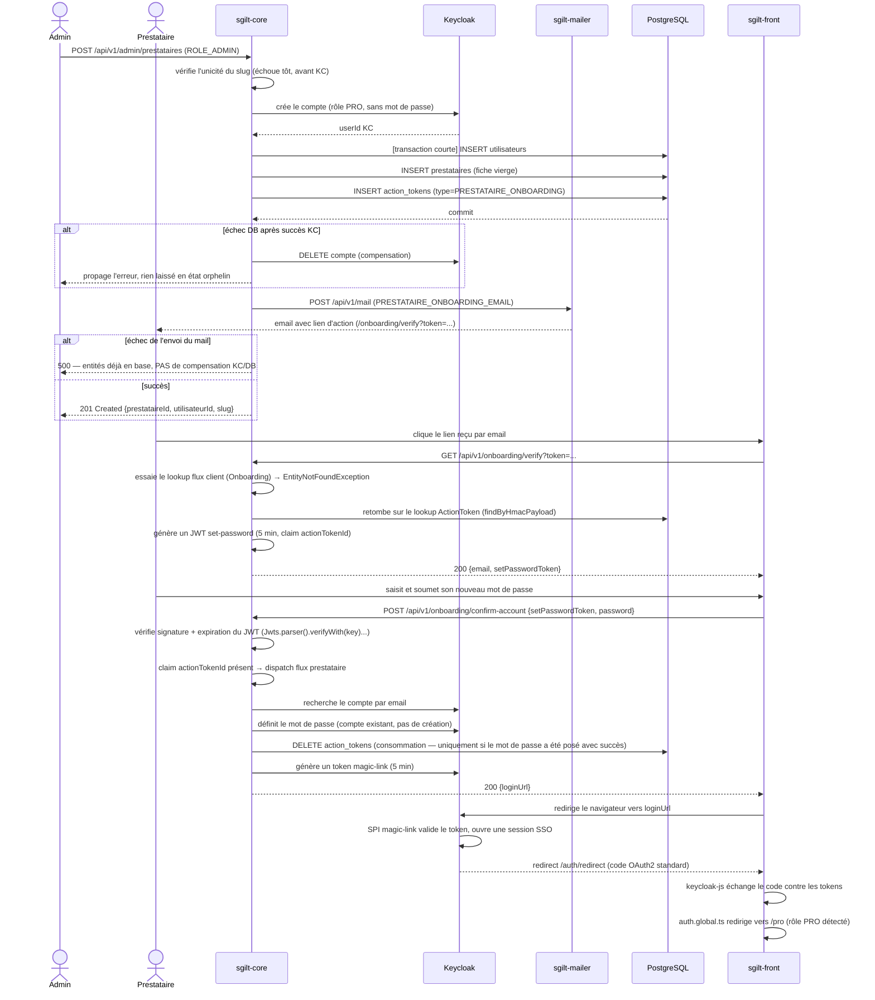
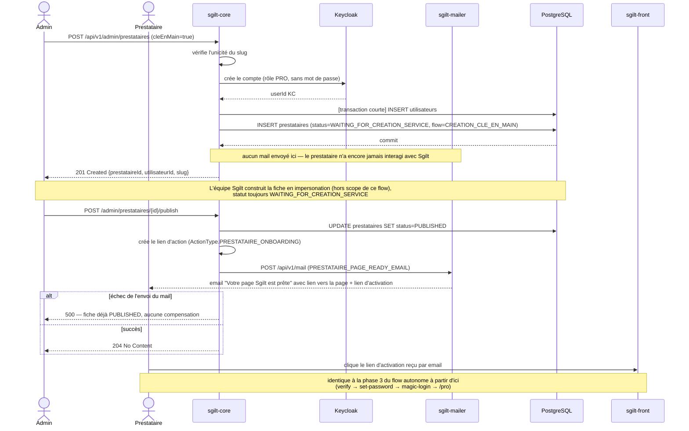

# Onboarding prestataire — flow technique

> Documentation technique du parcours complet de provisionnement d'un prestataire, du
> déclenchement par un admin jusqu'à la première connexion du prestataire. Pour le mode
> opératoire pratique ("comment créer un prestataire"), voir `PRO_ONBOARDING.md`.

## Vue d'ensemble

Depuis le 2026-09-02, il existe **deux flows de provisionnement**, distingués par le flag
`cleEnMain` de la requête admin :

| Flow                      | `cleEnMain` | Qui construit la fiche                                                       | Statut initial                 | Premier mail envoyé                                                                                                                           |
|---------------------------|-------------|------------------------------------------------------------------------------|--------------------------------|-----------------------------------------------------------------------------------------------------------------------------------------------|
| **Autonome** (historique) | `false`     | Le prestataire lui-même, après avoir défini son mot de passe                 | `DRAFT`                        | Mail d'activation, immédiatement à la création                                                                                                |
| **Clé en main** (nouveau) | `true`      | L'équipe Sgilt, en impersonation, avant que le prestataire n'existe pour lui | `WAITING_FOR_CREATION_SERVICE` | Rien à la création — le mail d'activation part seulement **à la publication** (`PrestataireService#publish`), une fois la fiche déjà en ligne |

Le flow clé-en-main saute complètement `IN_REVIEW` : c'est l'admin qui publie lui-même la fiche
qu'il vient de construire, sans qu'un prestataire distinct n'ait besoin de la soumettre.
`Prestataire.flow` (enum `PrestataireFlow` : `CREATION_CLE_EN_MAIN` / `CREATION_AUTONOME` /
`AUCUN` pour les fiches créées avant l'introduction du champ) trace ce choix et détermine quelle
notification est due à la publication ou en cas de relance — voir Phase 4bis ci-dessous.

Le flow est découpé en phases, toutes implémentées dans `sgilt-core` :

| Phase                                      | Déclencheur                                           | Composants principaux                                                                                      |
|--------------------------------------------|-------------------------------------------------------|------------------------------------------------------------------------------------------------------------|
| 1. Provisionnement admin                   | `POST /api/v1/admin/prestataires` (ROLE_ADMIN)        | `AdminController`, `KeycloakAdminService`, `PrestataireService`, `UtilisateurService`, `ActionLinkService` |
| 2. Notification (flow autonome uniquement) | Fin de la phase 1, après commit DB                    | `PrestataireMailerService`, `sgilt-mailer`                                                                 |
| 3. Vérification + set-password             | Clic du prestataire sur le lien reçu                  | `VerifyService`, `OnboardingService`, `ActionTokenService`, `KeycloakAdminService`                         |
| 4. Publication                             | Action admin, `POST /admin/prestataires/{id}/publish` | `PrestataireService#publish`                                                                               |
| 4bis. Notification de publication          | Fin de la phase 4, selon le flow d'origine            | `PrestataireMailerService`, `sgilt-mailer`                                                                 |

Le brief d'origine découpait le flow autonome en 4 étapes (provisionnement / set-password / mail /
verify). En pratique, l'étape "set-password" a été **absorbée** dans la phase 3 : il n'existe pas
d'endpoint dédié à la définition du mot de passe — c'est le même `POST /onboarding/confirm-account`
que celui déjà utilisé par le flux client, qui dispatch en interne selon le type de token.

---

## Séquence complète — flow autonome


```mermaid
sequenceDiagram
    actor Admin
    actor Prestataire
    participant Back as sgilt-core
    participant KC as Keycloak
    participant Mailer as sgilt-mailer
    participant DB as PostgreSQL
    participant Front as sgilt-front

    Admin->>Back: POST /api/v1/admin/prestataires (ROLE_ADMIN)
    Back->>Back: vérifie l'unicité du slug (échoue tôt, avant KC)
    Back->>KC: crée le compte (rôle PRO, sans mot de passe)
    KC-->>Back: userId KC

    Back->>DB: [transaction courte] INSERT utilisateurs
    Back->>DB: INSERT prestataires (fiche vierge)
    Back->>DB: INSERT action_tokens (type=PRESTATAIRE_ONBOARDING)
    DB-->>Back: commit

    alt échec DB après succès KC
        Back->>KC: DELETE compte (compensation)
        Back-->>Admin: propage l'erreur, rien laissé en état orphelin
    end

    Back->>Mailer: POST /api/v1/mail (PRESTATAIRE_ONBOARDING_EMAIL)
    Mailer-->>Prestataire: email avec lien d'action (/onboarding/verify?token=...)

    alt échec de l'envoi du mail
        Back-->>Admin: 500 — entités déjà en base, PAS de compensation KC/DB
    else succès
        Back-->>Admin: 201 Created {prestataireId, utilisateurId, slug}
    end

    Prestataire->>Front: clique le lien reçu par email
    Front->>Back: GET /api/v1/onboarding/verify?token=...
    Back->>Back: essaie le lookup flux client (Onboarding) → EntityNotFoundException
    Back->>DB: retombe sur le lookup ActionToken (findByHmacPayload)
    Back->>Back: génère un JWT set-password (5 min, claim actionTokenId)
    Back-->>Front: 200 {email, setPasswordToken}

    Prestataire->>Front: saisit et soumet son nouveau mot de passe
    Front->>Back: POST /api/v1/onboarding/confirm-account {setPasswordToken, password}
    Back->>Back: vérifie signature + expiration du JWT (Jwts.parser().verifyWith(key)...)
    Back->>Back: claim actionTokenId présent → dispatch flux prestataire
    Back->>KC: recherche le compte par email
    Back->>KC: définit le mot de passe (compte existant, pas de création)
    Back->>DB: DELETE action_tokens (consommation — uniquement si le mot de passe a été posé avec succès)
    Back->>KC: génère un token magic-link (5 min)
    Back-->>Front: 200 {loginUrl}

    Front->>KC: redirige le navigateur vers loginUrl
    KC->>KC: SPI magic-link valide le token, ouvre une session SSO
    KC-->>Front: redirect /auth/redirect (code OAuth2 standard)
    Front->>Front: keycloak-js échange le code contre les tokens
    Front->>Front: auth.global.ts redirige vers /pro (rôle PRO détecté)
```

## Séquence complète — flow clé-en-main


```mermaid
sequenceDiagram
    actor Admin
    actor Prestataire
    participant Back as sgilt-core
    participant KC as Keycloak
    participant Mailer as sgilt-mailer
    participant DB as PostgreSQL
    participant Front as sgilt-front

    Admin->>Back: POST /api/v1/admin/prestataires (cleEnMain=true)
    Back->>Back: vérifie l'unicité du slug
    Back->>KC: crée le compte (rôle PRO, sans mot de passe)
    KC-->>Back: userId KC

    Back->>DB: [transaction courte] INSERT utilisateurs
    Back->>DB: INSERT prestataires (status=WAITING_FOR_CREATION_SERVICE, flow=CREATION_CLE_EN_MAIN)
    DB-->>Back: commit

    Note over Back,Mailer: aucun mail envoyé ici — le prestataire n'a encore jamais interagi avec Sgilt

    Back-->>Admin: 201 Created {prestataireId, utilisateurId, slug}

    Note over Admin,DB: L'équipe Sgilt construit la fiche en impersonation (hors scope de ce flow),<br/>statut toujours WAITING_FOR_CREATION_SERVICE

    Admin->>Back: POST /admin/prestataires/{id}/publish
    Back->>DB: UPDATE prestataires SET status=PUBLISHED
    Back->>Back: crée le lien d'action (ActionType.PRESTATAIRE_ONBOARDING)
    Back->>Mailer: POST /api/v1/mail (PRESTATAIRE_PAGE_READY_EMAIL)
    Mailer-->>Prestataire: email "Votre page Sgilt est prête" avec lien vers la page + lien d'activation

    alt échec de l'envoi du mail
        Back-->>Admin: 500 — fiche déjà PUBLISHED, aucune compensation
    else succès
        Back-->>Admin: 204 No Content
    end

    Prestataire->>Front: clique le lien d'activation reçu par email
    Note over Prestataire,Front: identique à la phase 3 du flow autonome à partir d'ici<br/>(verify → set-password → magic-login → /pro)
```

Le mail de relance (`resend-onboarding-email`) suit la même branche que la publication : si
`prestataire.flow == CREATION_CLE_EN_MAIN`, il inclut le lien vers la page déjà en ligne
(`PRESTATAIRE_PAGE_READY_EMAIL`) plutôt que le simple mail d'activation.

---

## Phase 1 — Provisionnement admin

**Endpoint** : `POST /api/v1/admin/prestataires`, gardé par `ROLE_ADMIN` (distinct de `ROLE_PRO`,
porté uniquement par les comptes admin dédiés).

**Ordre des opérations**, du plus fragile au plus sûr :

1. Vérification de l'unicité du `slug` en base — échoue avant même d'appeler Keycloak si le slug
   est déjà pris.
2. Appel Keycloak (`KeycloakAdminService.createProUserWithoutPassword`) — **hors transaction DB**,
   pour ne pas tenir de connexion DB ouverte pendant l'aller-retour réseau. Crée le compte avec le
   rôle `PRO`, `emailVerified=true`, et **aucun credential** (donc aucun mot de passe utilisable).
3. Transaction DB courte (via `TransactionTemplate`, pas `@Transactional` — la frontière
   transactionnelle doit démarrer précisément après l'appel Keycloak, dans la même méthode) :
   - `Utilisateur` (email, prénom, nom)
   - `Prestataire` (fiche vierge : `slug`, `name`, `categoryKey`, `subcatKeys` seulement — tout le
     reste vide, le front gère l'état "ghost") — selon `request.cleEnMain()`, déléguée à
     `PrestataireService#createPrestataireCleEnMain` (statut `WAITING_FOR_CREATION_SERVICE`,
     **pas** d'`ActionToken` créé ici) ou `#createPrestataireAutonome` (statut `DRAFT`, crée
     immédiatement l'`ActionToken` et envoie le mail d'activation — voir phase 2)
4. Si la transaction DB échoue après que le compte KC a été créé : **compensation** — suppression
   du compte KC (`deleteUser`). Aucun prestataire ne doit rester à moitié provisionné.
5. Le controller ignore désormais quand et quel mail part : `PrestataireService.CreationResult`
   porte juste `notificationDelivered`, que `AdminController` traduit en 500 si `false`.

### Le mécanisme `ActionToken`

Généralisation du concept de token de confirmation, pensée pour être réutilisable par de futurs
flows (pas seulement l'onboarding prestataire) :

- `ActionType` porte un discriminant (`PRESTATAIRE_ONBOARDING`), un `frontPath` (route front à
  atteindre) et une `action` (ce que le front doit y déclencher).
- `ActionToken.payload` est un jsonb **libre**, propre à chaque flow — le mécanisme générique ne
  sait pas ce qu'il contient (ex. ici, juste `{"email": ...}`).
- `ActionLinkService.createLink(type, payload)` crée le token et construit l'URL d'action. **L'URL
  ne contient que le token opaque signé HMAC** — jamais `action` ni le `payload` en clair, parce
  que rien après le token dans l'URL n'est couvert par la signature (donc falsifiable si exposé).
  `type`/`action`/`payload` ne sont dérivables qu'en rechargeant la ligne `ActionToken` côté back,
  à la vérification.
- Durée de validité du lien : **1 semaine** (`sgilt.jwt.prestataire-onboarding-expiration-hours`,
  168h), propriété dédiée au flow prestataire — distincte de
  `sgilt.jwt.confirmation-expiration-hours` (24h, flow client, tunnel de demande initiale). Les
  deux propriétés partagent le même secret HMAC (`confirmationSecret`) mais des durées différentes,
  volontairement découplées pour ne pas impacter le tunnel client en changeant l'une ou l'autre.

### Compte-rendu des échecs

| Cas                                     | Réponse | KC          | DB                          |
|-------------------------------------------|---------|-------------|-------------------------------|
| Champ requis manquant                      | 400     | non appelé  | rien écrit                    |
| Slug déjà utilisé                          | 400     | non appelé  | rien écrit                    |
| Email déjà présent dans Keycloak           | 400     | échoue      | rien écrit (KC tenté en premier) |
| Échec DB après création du compte KC       | 500     | compensé (deleteUser) | rien ne reste          |
| Échec de la notification (flow autonome uniquement — le flow clé-en-main n'en envoie pas ici) | 500 | reste | reste (aucune compensation) |

Le dernier cas est **volontairement non compensé** : une fois la transaction DB commitée, tout
recréer coûterait un nouveau conflit de slug/email pour un nouvel appel. En rattrapage, le
back-office admin permet de renvoyer le mail (voir "Rattrapage : renvoi du mail" ci-dessous). Le
même principe de non-compensation s'applique à un échec de notification en phase 4 (publication).

---

## Phase 2 — Envoi du mail (flow autonome uniquement)

`PrestataireMailerService.sendPrestataireOnboardingEmail(prestataireEmail, firstName, actionUrl)` —
appelé après le commit de la transaction (jamais avant, pour ne jamais notifier un prestataire
dont les entités n'existent pas encore). **Ne s'exécute que pour le flow autonome** — le flow
clé-en-main ne notifie personne à cette étape (voir "Vue d'ensemble" et Phase 4bis).

- `MailType.PRESTATAIRE_ONBOARDING_EMAIL`, dupliqué et synchronisé à la main entre
  `sgilt-core` et `sgilt-mailer` (convention existante du projet — chaque `MailType` doit avoir un
  gabarit correspondant dans `sgilt-mailer/src/main/resources/mailtemplates/`, chargé au démarrage,
  échec rapide si absent).
- Ne relance jamais l'exception en cas d'échec réseau — retourne un `boolean`. C'est
  `AdminController` qui décide de la réponse HTTP à renvoyer (`500` si `false`), sans jamais
  compenser KC/DB.

### Rattrapage : renvoi du mail

Écran back-office dédié (`GET /admin/prestataires/onboarding-pending`) listant tous les
prestataires dont l'`ActionToken` `PRESTATAIRE_ONBOARDING` existe toujours en base (lien non
cliqué, qu'il soit encore valide ou déjà expiré). Chaque ligne expose un bouton de renvoi
(`POST /admin/prestataires/{id}/resend-onboarding-email`), orchestré par `AdminOnboardingService` :

1. Résout le prestataire par id, puis son `ActionToken` en attente par email
   (`ActionTokenService.findPendingByEmail`).
2. Réinitialise la date d'expiration du token existant à la durée de validité courante
   (`ActionTokenService.renewExpiration`) — **le token n'est pas régénéré**, seul son
   `expiresAt` change : le lien renvoyé par mail est identique à celui déjà envoyé (même token
   HMAC, reconstruit via `VerificationTokenHmacService.buildToken`).
3. Renvoie le mail via `PrestataireService.resendOnboardingEmail`, qui redispatche selon
   `prestataire.flow` — mail simple pour le flow autonome, `PRESTATAIRE_PAGE_READY_EMAIL` (avec
   lien vers la page) pour le flow clé-en-main.

Un pending token peut désormais exister sur une fiche déjà `PUBLISHED` : côté clé-en-main,
l'`ActionToken` n'est créé qu'à la publication (phase 4), donc une fiche publiée dont le
prestataire n'a toujours pas cliqué le lien reçu apparaît normalement dans cet écran.

---

## Phase 3 — Vérification et définition du mot de passe

Réutilise **intégralement** les endpoints et DTOs existants du flux client
(`GET /onboarding/verify`, `POST /onboarding/confirm-account`) — **aucun changement front**. Le
back dispatche en interne selon le type réel du token.

### Pourquoi un dispatch, et pas un lookup unique

Il existe aujourd'hui **deux tables de tokens séparées** :
- `onboarding` (flux client, pré-existant) — `OnboardingRepository.findByHmacPayload`
- `action_tokens` (flux prestataire, nouveau) — `ActionTokenRepository.findByHmacPayload`

Un token reçu par l'API est opaque : rien dans l'URL n'indique à quelle table il appartient. Le
choix retenu est un **pont temporaire par essai-erreur**, pas une vraie unification (jugée trop
lourde pour ce chantier — migration d'un flux client potentiellement en production). Voir le
ticket Trello *"Unifier les mécanismes de token de confirmation"* pour la cible.

### `VerifyService.verify(token)`

```
1. essaie onboardingSessionService.checkToken(token)   [flux client]
   → si EntityNotFoundException :
2.     essaie actionTokenService.checkToken(token)     [flux prestataire]
       → si EntityNotFoundException aussi : log.warn + propage (404)
```

Dans les deux cas, retourne le même DTO `SetPasswordTokenDto {email, setPasswordToken}`. Le JWT
`setPasswordToken` est généré par le **même bean** `setPasswordTokenJwtService` dans les deux cas
(entièrement générique — secret, sel et durée identiques), avec un claim différent selon le flow :
`onboardingId` (client) ou `actionTokenId` (prestataire).

**Durée de vie du JWT set-password : 5 minutes** (`JwtConfig.SET_PASSWORD_TOKEN_TTL`),
volontairement indépendante de la durée de validité du lien email (1 semaine,
`prestataireOnboardingExpirationHours`) — une fois le lien vérifié, la fenêtre pour soumettre effectivement
le mot de passe doit être courte. La vérification de signature est **implicite** : `isExpired`/
`extractClaims` passent par `Jwts.parser().verifyWith(key)...parseSignedClaims(token)`, qui valide
la signature avant même de retourner les claims — un token forgé lève une `JwtException` (400),
pas seulement un token expiré.

### `OnboardingService.confirmOnboarding(request)`

Décode le JWT une seule fois, puis dispatche selon le claim présent :

- **`actionTokenId` présent** → `confirmPrestataireOnboarding` :
  1. Charge l'`ActionToken` par id, lit l'email depuis son `payload` jsonb.
  2. Retrouve le compte KC **existant** par email (`getUserIdByEmail`) — pas de création.
  3. Définit le mot de passe dessus (`resetPassword` — différent de `createClientUser`, qui crée un
     nouveau compte).
  4. **Consomme le token** (`actionTokenService.consume` — suppression de la ligne) **seulement
     après** que le mot de passe a été posé avec succès, pas avant.
  5. Génère le lien magic-login vers `/pro`.
- **`onboardingId` présent** (comportement client inchangé) → `confirmAccount` : crée un nouveau
  compte KC, l'Utilisateur, l'Evenement, la Reservation, envoie le mail de bienvenue, génère le
  lien magic-login vers `/app/events/{id}`.

### Le lien magic-login (5 minutes, lui aussi)

`KeycloakAdminService.getMagicLoginUrl(email, redirectPath)` — **déjà générique**, prend un
`redirectPath` arbitraire. Construit une URL d'autorisation Keycloak portant un JWT signé
HMAC-SHA256 (`MAGIC_TOKEN_TTL_SECONDS = 300`, 5 min), validé par le SPI Keycloak custom
`magic-link` (`sgilt-keycloak/spi`) : celui-ci authentifie l'utilisateur par email sans mot de
passe, puis Keycloak poursuit son flow OIDC standard (redirect avec `code`). Côté front,
`keycloak-js` échange ce code contre les tokens, et `auth.global.ts` redirige automatiquement vers
`/pro` ou `/app` selon le rôle — **rien de spécifique au flow prestataire à coder côté front**,
ce mécanisme était déjà entièrement générique.

### Token expiré : distinction client / prestataire

`VerifyService` capture désormais le `TokenExpiredException` levé par chacun des deux lookups et le
relève avec un `OnboardingFlow` (`CLIENT` ou `PRESTATAIRE`) attaché — porté jusqu'au front par
`TokenExpiredResponseDto`. Sur `/onboarding/verify.vue`, un token expiré affiche désormais un écran
d'erreur avec un bouton "se connecter" (`useKeycloak().login()`) plutôt qu'un simple message texte,
pertinent surtout côté prestataire : son compte KC existe déjà (créé sans mot de passe en phase 1),
donc un lien expiré n'est pas forcément bloquant s'il a par ailleurs déjà un moyen de se connecter.

---

## Phase 4 — Publication

**Endpoint** : `POST /admin/prestataires/{id}/publish`, action admin (`PrestataireService#publish`).

- Statuts de départ acceptés : `IN_REVIEW` (flow autonome, le prestataire a soumis sa fiche) **ou**
  `WAITING_FOR_CREATION_SERVICE` (flow clé-en-main, jamais soumise par un prestataire — c'est
  l'admin qui juge la fiche prête). Tout autre statut de départ lève une
  `PrestataireInvalidStateException`.
- Dans tous les cas : `status → PUBLISHED`, puis notification (phase 4bis) selon `prestataire.flow`.
- Retourne `false` si la notification a échoué ; `AdminController` traduit ça en `500` — la fiche
  reste publiée, aucune compensation (même logique qu'en phase 1/2 : republier coûterait un nouveau
  conflit d'état, mieux vaut relancer la notification que défaire la publication).

## Phase 4bis — Notification de publication

Selon `prestataire.flow`, `PrestataireService#publish` envoie l'un des deux mails suivants
(jamais les deux) :

| `flow`                  | Mail envoyé                    | Contenu                                                                 |
|--------------------------|----------------------------------|----------------------------------------------------------------------------|
| `CREATION_CLE_EN_MAIN`  | `PRESTATAIRE_PAGE_READY_EMAIL` | "Votre page Sgilt est prête" — lien vers la page **et** lien d'activation (le prestataire n'a jamais reçu de mail avant celui-ci) |
| `CREATION_AUTONOME`     | `PRESTATAIRE_PUBLISHED_EMAIL`  | "Votre page Sgilt est en ligne" — simple notification, pas de lien d'activation (mot de passe déjà défini en phase 3) |

Les deux `MailType` sont, comme en phase 2, dupliqués et synchronisés à la main entre `sgilt-core`
et `sgilt-mailer` (gabarits dans `sgilt-mailer/src/main/resources/mailtemplates/`).

---

## Limitations connues / dette technique assumée

| Sujet | État | Détail |
|---|---|---|
| Deux tables de tokens | Pont temporaire (dispatch essai-erreur) | Voir ticket Trello "Unifier les mécanismes de token de confirmation" |
| Session SSO magic-link | Bug connu, non corrigé | Si le navigateur a déjà une session KC active pour un autre utilisateur, le magic-link ne la remplace pas. Piste : `prompt=login` sur l'URL générée par `getMagicLoginUrl` — nécessite une vérification en navigateur réel |
| `ActionType.action()` | Champ présent mais non consommé | Pensé pour que le front puisse un jour dispatcher son propre affichage selon l'action ; pour l'instant le front ne change pas, donc rien ne le lit encore |

---

## Pointeurs code

- `sgilt-core/.../admin/controller/AdminController.java` — phase 1 (provisionnement), phase 4 (publish)
- `sgilt-core/.../prestataire/service/PrestataireService.java` — `createPrestataireCleEnMain`,
  `createPrestataireAutonome`, `publish`, `resendOnboardingEmail` : centralise le choix du flow et
  de la notification associée
- `sgilt-core/.../prestataire/domain/PrestataireFlow.java`, `PrestataireStatus.java` — `flow` et
  `status` de la fiche
- `sgilt-core/.../prestataire/mailer/PrestataireMailerService.java` — phase 2 et 4bis (les trois
  mails : `sendPrestataireOnboardingEmail`, `sendPrestatairePageReadyEmail`,
  `sendPrestatairePublishedEmail`)
- `sgilt-core/.../admin/service/AdminOnboardingService.java` — rattrapage : liste + renvoi du mail
- `sgilt-core/.../onboarding/service/VerifyService.java` — phase 3, dispatch verify, relève
  `TokenExpiredException` avec l'`OnboardingFlow` concerné
- `sgilt-core/.../onboarding/domain/OnboardingFlow.java` — `CLIENT` / `PRESTATAIRE`
- `sgilt-core/.../onboarding/service/OnboardingService.java` — phase 3, dispatch confirm
- `sgilt-core/.../jwt/` — `ActionToken`, `ActionType`, `ActionTokenService`, `ActionLinkService`,
  `VerificationTokenHmacService`, `JwtConfig`
- `sgilt-core/.../keycloak/KeycloakAdminService.java` — `createProUserWithoutPassword`,
  `getUserIdByEmail`, `resetPassword`, `getMagicLoginUrl`
- `sgilt-keycloak/spi/` — authenticator `magic-link`
- `sgilt-front/app/pages/onboarding/verify.vue`, `sgilt-front/app/middleware/auth.global.ts`
- `sgilt-front/app/pages/admin/creer-prestataire.vue` — formulaire admin, toggle clé-en-main/autonome
- `sgilt-front/app/pages/admin/onboarding.vue` — écran BO des onboardings en attente (renvoi de mail)
