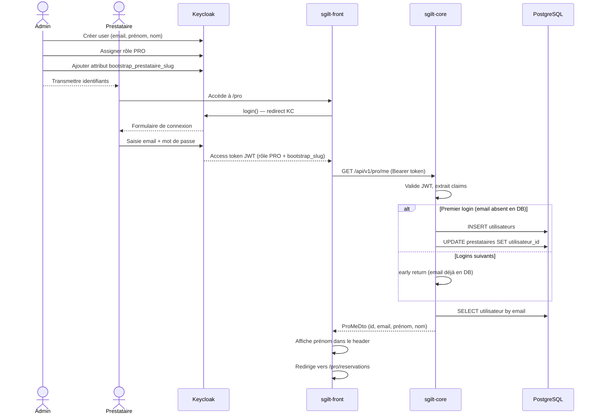

# Création d'un compte prestataire

> Le détail technique complet du flow (séquence, gestion d'erreurs, mécanisme de token) est dans
> `PRESTATAIRE_ONBOARDING_FLOW.md`. Ce document-ci est le mode opératoire pratique.

## Prérequis

Être admin avec un compte Keycloak portant le rôle `ADMIN` (distinct de `PRO`).

---

## Mode opératoire — provisionnement via l'API admin

Un seul appel API suffit : plus besoin de créer le compte Keycloak à la main.

### `POST /api/v1/admin/prestataires`

Gardé par `ROLE_ADMIN`. Body JSON :

| Champ             | Description                                                             |
|-------------------|-------------------------------------------------------------------------|
| `email`           | email du prestataire (aussi utilisé comme username Keycloak)            |
| `firstName`       | prénom                                                                  |
| `lastName`        | nom                                                                     |
| `slug`            | identifiant public de la fiche — doit être unique, fourni explicitement |
| `prestataireName` | nom du prestataire                                                      |
| `category`        | clé de catégorie (string libre)                                         |
| `subcats`         | clés de sous-catégories séparées par des virgules (peut être vide)      |

Tous les champs sont requis sauf `subcats`. Un champ manquant → 400, rien n'est créé.

### Exemple

```bash
curl --request POST \
  --url https://<gateway>/api/v1/admin/prestataires \
  --header 'authorization: Bearer <token du compte ADMIN>' \
  --header 'content-type: application/json' \
  --data '{
    "email": "dj-max@example.com",
    "firstName": "Max",
    "lastName": "Dupont",
    "slug": "dj-max",
    "prestataireName": "DJ Max",
    "category": "music",
    "subcats": "dj,mariage"
  }'
```

### Réponse

`201 Created` :

```json
{
  "prestataireId": "…",
  "utilisateurId": "…",
  "slug": "dj-max"
}
```

### Ce que l'appel déclenche automatiquement

1. Compte Keycloak créé (rôle `PRO`, **sans mot de passe utilisable** — connexion impossible tant
   que le prestataire n'a pas suivi le lien reçu par email).
2. `Utilisateur` + `Prestataire` (fiche vierge : slug/nom/catégorie renseignés, le reste vide)
   créés en base et liés.
3. Un token de confirmation créé, propre à ce flow.
4. Un email d'activation envoyé automatiquement au prestataire.

Le prestataire clique le lien reçu, définit son mot de passe, et arrive connecté directement sur
sa fiche éditable `/pro/fiche-edition` — aucune action manuelle supplémentaire de ton côté.

### Si ça échoue

| Cas                                               | Réponse | Ce qui a été écrit                                                                                                                                                       |
|---------------------------------------------------|---------|--------------------------------------------------------------------------------------------------------------------------------------------------------------------------|
| Champ requis manquant                             | 400     | Rien                                                                                                                                                                     |
| Slug déjà utilisé                                 | 400     | Rien                                                                                                                                                                     |
| Email déjà présent dans Keycloak                  | 400     | Rien                                                                                                                                                                     |
| Échec technique après création du compte Keycloak | 500     | Rien (compte Keycloak supprimé automatiquement)                                                                                                                          |
| Échec de l'envoi du mail                          | 500     | **Le compte existe déjà** (Keycloak + base) mais le prestataire n'a pas reçu son lien — pas encore de bouton "renvoyer le lien", à traiter au cas par cas pour l'instant |

---

## [Legacy] Mode opératoire manuel

> ⚠️ **Obsolète** — à n'utiliser que pour un cas exceptionnel où l'API admin ne conviendrait pas.
> Pour tout nouveau prestataire, utiliser la procédure ci-dessus.

Le bootstrap au premier login (décrit ci-dessous) existe toujours techniquement dans le code
(`ProProvisioningService`), mais n'est plus le chemin normal — il ne s'active que si l'`Utilisateur`
n'existe pas encore en base au moment du premier login, ce qui n'arrive plus avec la procédure API.

### Prérequis

Le prestataire doit déjà exister en base de données avec un `slug` unique.

### 1. Keycloak — créer le compte

Dans le dashboard Keycloak : **Realm `sgilt` → Users → Create new user**

| Champ          | Valeur                       |
|----------------|-------------------------------|
| Username       | adresse email du prestataire |
| Email          | adresse email du prestataire |
| First name     | prénom                       |
| Last name      | nom                          |
| Email verified | ✅ activé                     |

**Sauvegarder.**

### 2. Keycloak — définir un mot de passe

Onglet **Credentials → Set password**

- Saisir un mot de passe temporaire
- Désactiver "Temporary" si on ne veut pas forcer le changement au premier login

### 3. Keycloak — assigner le rôle PRO

Onglet **Role mapping → Assign role**

- Filtrer par `realm roles`
- Sélectionner **`PRO`**

### 4. Keycloak — ajouter l'attribut bootstrap

Onglet **Attributes → Add an attribute**

| Key                          | Value                                           |
|-------------------------------|---------------------------------------------------|
| `bootstrap_prestataire_slug` | slug du prestataire (ex : `photographe-alsace`) |

**Sauvegarder.**

### 5. Transmettre les identifiants au prestataire

Communiquer l'email et le mot de passe temporaire par un canal sécurisé.

---

### Ce qui se passe au premier login (legacy)

Au premier accès à `/pro`, le système :

1. Crée la ligne `Utilisateur` en base à partir des claims JWT (`email`, `given_name`, `family_name`)
2. Recherche le `Prestataire` par le slug contenu dans le claim `bootstrap_prestataire_slug`
3. Lie le `Prestataire` à l'`Utilisateur`
4. Redirige vers `/pro/reservations`

Lors des connexions suivantes, les étapes 1 à 3 sont court-circuitées — l'`Utilisateur` existe déjà.

### Diagramme de séquence (legacy)



### Points d'attention (legacy)

- **Slug incorrect** : si `bootstrap_prestataire_slug` ne correspond à aucun prestataire actif, le premier login retourne 404. Vérifier le slug en base avant de créer le compte KC.
- **Attribut manquant** : si l'attribut `bootstrap_prestataire_slug` est absent, aucun `Utilisateur` n'est créé → 404 au premier login. L'attribut doit être présent sur le compte KC.
- **Compte existants** : les prestataires créés avant cette procédure ont besoin que l'`Utilisateur` DB soit créé et lié manuellement (ou via un premier login avec l'attribut bootstrap configuré).
