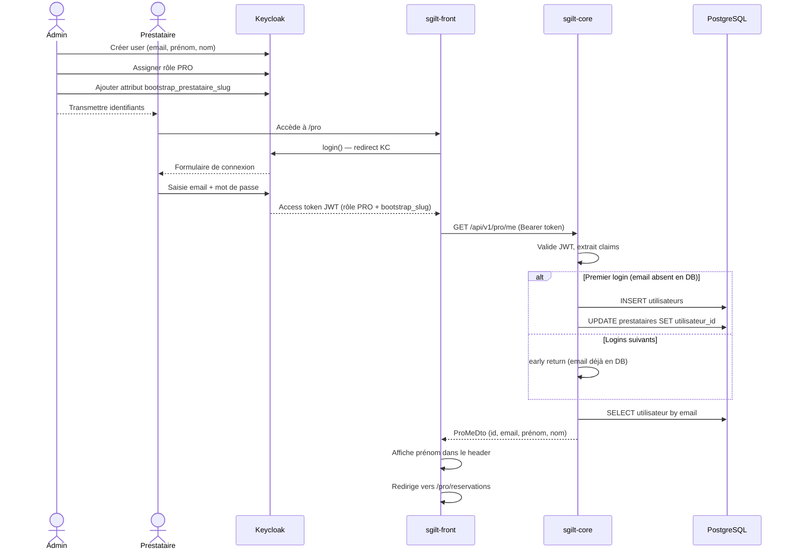

# Création d'un compte prestataire

## Prérequis

Le prestataire doit déjà exister en base de données avec un `slug` unique.

---

## Mode opératoire

### 1. Keycloak — créer le compte

Dans le dashboard Keycloak : **Realm `sgilt` → Users → Create new user**

| Champ          | Valeur                       |
|----------------|------------------------------|
| Username       | adresse email du prestataire |
| Email          | adresse email du prestataire |
| First name     | prénom                       |
| Last name      | nom                          |
| Email verified | ✅ activé                     |

**Sauvegarder.**

---

### 2. Keycloak — définir un mot de passe

Onglet **Credentials → Set password**

- Saisir un mot de passe temporaire
- Désactiver "Temporary" si on ne veut pas forcer le changement au premier login

---

### 3. Keycloak — assigner le rôle PRO

Onglet **Role mapping → Assign role**

- Filtrer par `realm roles`
- Sélectionner **`PRO`**

---

### 4. Keycloak — ajouter l'attribut bootstrap

Onglet **Attributes → Add an attribute**

| Key                          | Value                                           |
|------------------------------|-------------------------------------------------|
| `bootstrap_prestataire_slug` | slug du prestataire (ex : `photographe-alsace`) |

**Sauvegarder.**

---

### 5. Transmettre les identifiants au prestataire

Communiquer l'email et le mot de passe temporaire par un canal sécurisé.

---

## Ce qui se passe au premier login

Au premier accès à `/pro`, le système :

1. Crée la ligne `Utilisateur` en base à partir des claims JWT (`email`, `given_name`, `family_name`)
2. Recherche le `Prestataire` par le slug contenu dans le claim `bootstrap_prestataire_slug`
3. Lie le `Prestataire` à l'`Utilisateur`
4. Redirige vers `/pro/reservations`

Lors des connexions suivantes, les étapes 1 à 3 sont court-circuitées — l'`Utilisateur` existe déjà.

---

## Diagramme de séquence

---

## Points d'attention

- **Slug incorrect** : si `bootstrap_prestataire_slug` ne correspond à aucun prestataire actif, le premier login retourne 404. Vérifier le slug en base avant de créer le compte KC.
- **Attribut manquant** : si l'attribut `bootstrap_prestataire_slug` est absent, aucun `Utilisateur` n'est créé → 404 au premier login. L'attribut doit être présent sur le compte KC.
- **Compte existants** : les prestataires créés avant cette procédure ont besoin que l'`Utilisateur` DB soit créé et lié manuellement (ou via un premier login avec l'attribut bootstrap configuré).
