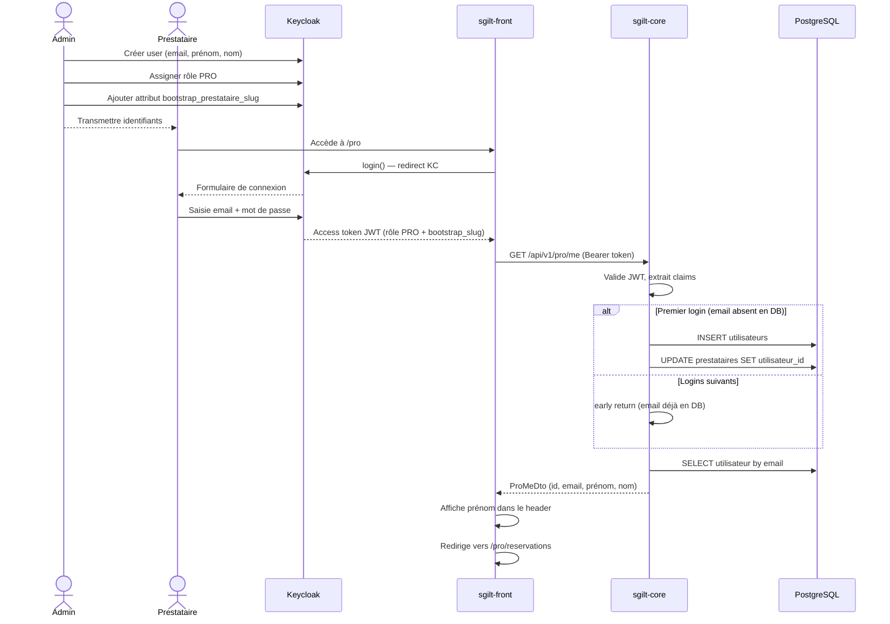

# Création d'un compte prestataire

> Le détail technique complet du flow (séquence, gestion d'erreurs, mécanisme de token) est dans
> `PRESTATAIRE_ONBOARDING_FLOW.md`. Ce document-ci est le mode opératoire pratique.

## Prérequis

Être admin avec un compte Keycloak portant le rôle `ADMIN` (distinct de `PRO`).

---

## Deux flows au choix

Depuis le 2026-09-02, la création se décline en deux flows, choisis via la case à cocher
"clé en main" du formulaire (ou le champ `cleEnMain` de l'API) :

| Flow | Quand l'utiliser | Ce que fait le prestataire |
|---|---|---|
| **Autonome** (par défaut) | Le prestataire va construire sa propre fiche | Reçoit le mail d'activation immédiatement, définit son mot de passe, remplit et soumet sa fiche |
| **Clé en main** | L'équipe Sgilt construit la fiche à sa place (en impersonation) | Ne reçoit **aucun mail à la création** — seulement une fois la fiche publiée par l'admin, avec le lien vers sa page déjà en ligne **et** le lien d'activation |

Le détail technique complet (statuts, notifications, dispatch) est dans
`PRESTATAIRE_ONBOARDING_FLOW.md`.

## Mode opératoire — écran admin

Depuis **BO admin → Prestataires → Créer un prestataire** (`/admin/creer-prestataire`) :

1. Remplir le formulaire : prénom, nom, email, nom du prestataire, slug, catégorie, sous-catégories.
2. Cocher **"Clé en main"** si c'est l'équipe Sgilt qui construit la fiche — laisser décoché pour le
   flow autonome (comportement historique).
3. Valider. En cas de succès, le slug créé s'affiche ; en cas d'échec, un message d'erreur générique
   (voir "Si ça échoue" ci-dessous pour le détail par cas).

Pour relancer un mail d'activation resté sans clic (lien expiré ou non reçu), voir
**BO admin → Onboarding → Prestataires** (`/admin/onboarding`) — fonctionne pour les
deux flows, y compris une fiche clé-en-main déjà publiée.

## Mode opératoire — via l'API admin directement

Utile pour scripter une création en masse, ou déboguer. Équivalent à l'écran admin.

### `POST /api/v1/admin/prestataires`

Gardé par `ROLE_ADMIN`. Body JSON :

| Champ             | Description                                                                |
|-------------------|------------------------------------------------------------------------------|
| `email`           | email du prestataire (aussi utilisé comme username Keycloak)               |
| `firstName`       | prénom                                                                     |
| `lastName`        | nom                                                                        |
| `slug`            | identifiant public de la fiche — doit être unique, fourni explicitement    |
| `prestataireName` | nom du prestataire                                                         |
| `category`        | clé de catégorie (string libre)                                            |
| `subcats`         | clés de sous-catégories séparées par des virgules (peut être vide)         |
| `cleEnMain`       | `true` pour le flow clé-en-main, `false` (ou absent) pour le flow autonome |

Tous les champs sont requis sauf `subcats` et `cleEnMain`. Un champ manquant → 400, rien n'est créé.

### Exemple — flow autonome

```bash
curl --request POST \
  --url https://<gateway>/api/v1/admin/prestataires \
  --header 'authorization: Bearer <token du compte ADMIN>' \
  --header 'content-type: application/json' \
  --data '{
    "email": "dj-max@example.com",
    "firstName": "Max",
    "lastName": "Dupont",
    "slug": "dj-max",
    "prestataireName": "DJ Max",
    "category": "music",
    "subcats": "dj,mariage",
    "cleEnMain": false
  }'
```

### Réponse

`201 Created` :

```json
{
  "prestataireId": "…",
  "utilisateurId": "…",
  "slug": "dj-max"
}
```

### Ce que l'appel déclenche automatiquement

**Dans tous les cas** :
1. Compte Keycloak créé (rôle `PRO`, **sans mot de passe utilisable** — connexion impossible tant
   que le prestataire n'a pas suivi un lien d'activation).
2. `Utilisateur` + `Prestataire` (fiche vierge : slug/nom/catégorie renseignés, le reste vide)
   créés en base et liés.

**Flow autonome** (`cleEnMain: false`) — en plus :
3. Un token de confirmation créé.
4. Un email d'activation envoyé immédiatement au prestataire.

Le prestataire clique le lien reçu, définit son mot de passe, et arrive connecté directement sur
sa fiche éditable `/pro/fiche-edition`.

**Flow clé-en-main** (`cleEnMain: true`) — en plus :
3. La fiche reste au statut `WAITING_FOR_CREATION_SERVICE`, **aucun mail envoyé**.
4. L'équipe Sgilt construit la fiche (en impersonation, hors scope de cet endpoint).
5. À la publication (`POST /admin/prestataires/{id}/publish`), le token de confirmation est créé et
   le mail d'activation part — avec en plus le lien vers la page, déjà visible publiquement.

### Si ça échoue

| Cas                                                  | Réponse | Ce qui a été écrit                                                                                                                                              |
|--------------------------------------------------------|---------|--------------------------------------------------------------------------------------------------------------------------------------------------------------------|
| Champ requis manquant                                | 400     | Rien                                                                                                                                                              |
| Slug déjà utilisé                                    | 400     | Rien                                                                                                                                                              |
| Email déjà présent dans Keycloak                     | 400     | Rien                                                                                                                                                              |
| Échec technique après création du compte Keycloak    | 500     | Rien (compte Keycloak supprimé automatiquement)                                                                                                                   |
| Échec de la notification (flow autonome uniquement)  | 500     | **Le compte existe déjà** (Keycloak + base) mais le prestataire n'a pas reçu son lien — utiliser le bouton "renvoyer le lien" dans **Onboardings en attente**    |

Pour le flow clé-en-main, aucune notification n'étant due à la création, cette dernière ligne ne
s'applique pas ici — voir plutôt l'échec de publication ci-dessous.

### Publier une fiche clé-en-main

Une fois la fiche construite (hors scope de ce document), publier via
`POST /admin/prestataires/{id}/publish`. Si l'envoi du mail échoue, la fiche reste `PUBLISHED`
(pas de compensation) — utiliser le bouton "renvoyer le lien" dans **Onboardings en attente**.

---

## [Legacy] Mode opératoire manuel

> ⚠️ **Obsolète** — à n'utiliser que pour un cas exceptionnel où l'API admin ne conviendrait pas.
> Pour tout nouveau prestataire, utiliser la procédure ci-dessus.

Le bootstrap au premier login (décrit ci-dessous) existe toujours techniquement dans le code
(`ProProvisioningService`), mais n'est plus le chemin normal — il ne s'active que si l'`Utilisateur`
n'existe pas encore en base au moment du premier login, ce qui n'arrive plus avec la procédure API.

### Prérequis

Le prestataire doit déjà exister en base de données avec un `slug` unique.

### 1. Keycloak — créer le compte

Dans le dashboard Keycloak : **Realm `sgilt` → Users → Create new user**

| Champ          | Valeur                       |
|----------------|-------------------------------|
| Username       | adresse email du prestataire |
| Email          | adresse email du prestataire |
| First name     | prénom                       |
| Last name      | nom                          |
| Email verified | ✅ activé                     |

**Sauvegarder.**

### 2. Keycloak — définir un mot de passe

Onglet **Credentials → Set password**

- Saisir un mot de passe temporaire
- Désactiver "Temporary" si on ne veut pas forcer le changement au premier login

### 3. Keycloak — assigner le rôle PRO

Onglet **Role mapping → Assign role**

- Filtrer par `realm roles`
- Sélectionner **`PRO`**

### 4. Keycloak — ajouter l'attribut bootstrap

Onglet **Attributes → Add an attribute**

| Key                          | Value                                           |
|-------------------------------|---------------------------------------------------|
| `bootstrap_prestataire_slug` | slug du prestataire (ex : `photographe-alsace`) |

**Sauvegarder.**

### 5. Transmettre les identifiants au prestataire

Communiquer l'email et le mot de passe temporaire par un canal sécurisé.

---

### Ce qui se passe au premier login (legacy)

Au premier accès à `/pro`, le système :

1. Crée la ligne `Utilisateur` en base à partir des claims JWT (`email`, `given_name`, `family_name`)
2. Recherche le `Prestataire` par le slug contenu dans le claim `bootstrap_prestataire_slug`
3. Lie le `Prestataire` à l'`Utilisateur`
4. Redirige vers `/pro/reservations`

Lors des connexions suivantes, les étapes 1 à 3 sont court-circuitées — l'`Utilisateur` existe déjà.

### Diagramme de séquence (legacy)


```mermaid
sequenceDiagram
    actor Admin
    actor Prestataire
    participant KC as Keycloak
    participant Front as sgilt-front
    participant Back as sgilt-core
    participant DB as PostgreSQL

    Admin->>KC: Créer user (email, prénom, nom)
    Admin->>KC: Assigner rôle PRO
    Admin->>KC: Ajouter attribut bootstrap_prestataire_slug
    Admin-->>Prestataire: Transmettre identifiants

    Prestataire->>Front: Accède à /pro
    Front->>KC: login() — redirect KC
    KC-->>Prestataire: Formulaire de connexion
    Prestataire->>KC: Saisie email + mot de passe
    KC-->>Front: Access token JWT (rôle PRO + bootstrap_slug)

    Front->>Back: GET /api/v1/pro/me (Bearer token)
    Back->>Back: Valide JWT, extrait claims

    alt Premier login (email absent en DB)
        Back->>DB: INSERT utilisateurs
        Back->>DB: UPDATE prestataires SET utilisateur_id
    else Logins suivants
        Back->>Back: early return (email déjà en DB)
    end

    Back->>DB: SELECT utilisateur by email
    Back-->>Front: ProMeDto (id, email, prénom, nom)
    Front->>Front: Affiche prénom dans le header
    Front->>Front: Redirige vers /pro/reservations
```

### Points d'attention (legacy)

- **Slug incorrect** : si `bootstrap_prestataire_slug` ne correspond à aucun prestataire actif, le premier login retourne 404. Vérifier le slug en base avant de créer le compte KC.
- **Attribut manquant** : si l'attribut `bootstrap_prestataire_slug` est absent, aucun `Utilisateur` n'est créé → 404 au premier login. L'attribut doit être présent sur le compte KC.
- **Compte existants** : les prestataires créés avant cette procédure ont besoin que l'`Utilisateur` DB soit créé et lié manuellement (ou via un premier login avec l'attribut bootstrap configuré).
